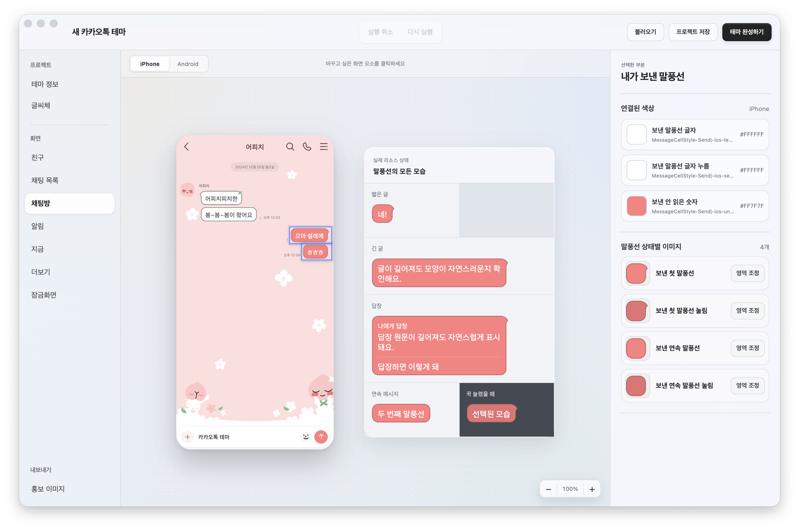

  

<h1 align="center">Bear KTBaker</h1>

iPhone·Android 카카오톡 사용자 테마를 하나의 프로젝트에서 함께 제작하는 Electron 데스크톱 앱

  
  
  

  <a href="#다운로드"><b>다운로드</b></a> ·
  <a href="#주요-기능">주요 기능</a> ·
  <a href="#스크린샷">스크린샷</a> ·
  <a href="RELEASES.md">전체 릴리스 보기</a>

---

## 소개

**Bear KTBaker**는 카카오톡 사용자 테마(`.ktheme`, `.apk`)를 iPhone과 Android 두 플랫폼에 대해 동시에 제작할 수 있는 데스크톱 앱입니다. 공식 샘플 리소스를 기준으로 실제 카카오톡 화면과 동일한 비율의 미리보기를 제공하며, 이미지·색상·글꼴을 편집하는 즉시 두 플랫폼의 결과물을 함께 확인할 수 있습니다.

## 주요 기능

- 공식 샘플 리소스를 기반으로 한 iPhone·Android 화면 실시간 미리보기
- 이미지, 색상, 글꼴 및 프로필 리소스 편집
- iOS 인셋(inset)과 Android 9-patch 영역 조정
- `.ktheme`(iOS) / `.apk`(Android) 내보내기
- `.ktstudio` 프로젝트 저장 및 다시 불러오기
- 테마 홍보 이미지 PNG 자동 생성

## 스크린샷

  

  

## 다운로드

macOS(Apple Silicon / Intel 유니버설)와 Windows 10/11(64-bit)용 설치 파일을 제공합니다.

최신 버전은 **v0.1.7**입니다. 이전 버전 다운로드와 체크섬은 [RELEASES.md](RELEASES.md)에서 확인할 수 있습니다.

### 설치 안내

앱이 코드 서명(notarization) 없이 배포되어 최초 실행 시 운영체제 경고가 표시될 수 있습니다.

- **macOS**: "Apple은 'Bear KTBaker'에 사용자의 Mac에 손상을 입히거나 사용자의 개인정보에 침입할 수 있는 악성 코드가 없음을 확인할 수 없습니다"라는 경고가 뜨면, `시스템 설정 → 개인정보 보호 및 보안 → 보안`에서 **그래도 열기**를 선택해 주세요. 그러면 정상적으로 실행됩니다.
- **Windows**: SmartScreen 경고가 뜨면 **추가 정보 → 실행**을 선택해 주세요.

## 버그 제보 및 제안

[GitHub Issues](https://github.com/RudinP/Bear-KTBaker/issues)를 통해 버그 제보와 기능 제안을 남겨 주세요.

## 라이선스

이 저장소의 소스 코드는 별도의 오픈소스 라이선스 없이 **모든 권리를 저작권자가 보유**합니다. 사전 동의 없는 재배포·수정·상업적 이용을 금합니다.

## 안내

- KakaoTalk과 Kakao는 해당 권리자의 상표입니다. 이 프로젝트는 Kakao의 공식 제품이 아닙니다.
- 앱이 제공하는 미리보기는 실제 카카오톡 구동 화면과 완벽하게 동일하지 않으며, 참고용 예상도 정도로만 파악해 주시기 바랍니다.
- 테마 제작에 사용되는 카카오톡 관련 리소스의 저작권은 Kakao에 있으며, 이를 기반으로 영리적 이득을 취할 의도가 전혀 없음을 밝힙니다.
- 이 프로그램 제작에는 AI의 도움을 받았습니다.
