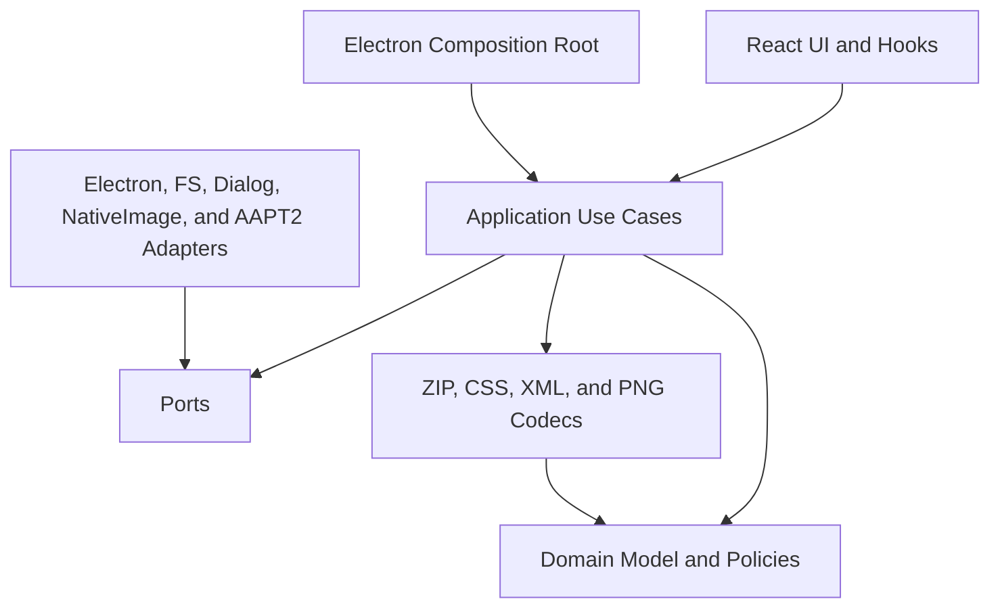
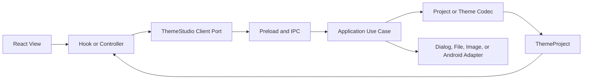

# SOLID Maintainability Refactor Design

**Date:** 2026-07-19
**Status:** Approved
**Scope:** Internal architecture, error diagnostics, unused-code removal, and quality gates

## Context

Bear KTBaker has a strong regression baseline, but several files combine responsibilities that change for different reasons:

- `electron/main.ts` owns application lifecycle, IPC, dialogs, filesystem work, image conversion, theme import, and both export pipelines.
- `src/io/themeImport.ts` combines format detection, CSS and XML parsing, PNG and 9-patch recovery, color mapping, and cross-platform resource mirroring.
- `src/App.tsx` combines project history, keyboard commands, preview pan and zoom, file operations, and modal composition.
- `src/components/PhonePreview.tsx` contains shared editing primitives plus every platform and screen renderer.
- `src/domain/theme.ts` combines model types, defaults, serialization, parsing, and project migrations.

The application-source baseline is commit `6ffd336` (`Fix Android maintab 9-patch export`) at version 0.1.3. The remote `main` branch points to that commit. The later design-only commit changes no application source. The baseline contains 42 test files and 471 passing tests. `npm run typecheck` and `npm run audit:theme` also pass. The repository has no lint command, no script-specific TypeScript project, and no enforced unused-export check.

Commit `6ffd336` contains the Android maintab 9-patch export changes in:

- `package.json`
- `package-lock.json`
- `scripts/verify-standalone-android-export.ts`
- `src/io/androidImageVerification.test.ts`
- `src/io/ninePatchPng.ts`

The focused Android image and nine-patch suite passes 11 tests. `npm run verify:android-runtime` builds and inspects a signed standalone APK, verifies 37 images, 44 colors, and four compiled image expectations, and confirms the new maintab checks. The refactor must preserve this behavior.

## Goals

1. Establish a layered dependency direction based on domain, application use cases, ports, and infrastructure adapters.
2. Give each module one reason to change and expose narrow contracts between modules.
3. Preserve the current UI, DOM hierarchy, CSS selectors, project format, renderer API, and user-visible success behavior.
4. Keep support for `.ktstudio` files created by earlier versions.
5. Remove unused internal code, temporary compatibility facades, stale exports, and unused dependencies.
6. Attach a stable, searchable error code and operation stage to each user-visible failure.
7. Add automated checks that prevent the same coupling and unused-code problems from returning.

## Non-goals

- The refactor will not redesign the UI or change editor behavior.
- The refactor will not change theme output semantics.
- The refactor will not remove migrations that load older `.ktstudio` files.
- The refactor will not introduce repositories, classes, or interfaces for pure calculations.
- The refactor will not replace working parsers solely because they use functions instead of classes.
- The refactor will not push, publish, or change the application version by itself.

## Global Constraints

- Existing `.ktstudio` fixtures must load before and after the refactor.
- Commit `6ffd336` and version 0.1.3 form the refactor baseline.
- Android maintab 9-patch parsing and standalone export verification must remain active.
- The application must save projects in the current format.
- Runtime project migrations remain supported production code.
- Renderer-facing `window.themeStudio` method signatures and success values remain compatible.
- Dialog cancellation remains a non-error result.
- Android export keeps its existing success and error behavior at the renderer boundary.
- CSS classes, test IDs, accessibility labels, and preview DOM nesting remain unchanged during file extraction.
- `release/`, `dist/`, and `dist-electron/` outputs must not enter a commit.
- The package versions in `package.json` and the root of `package-lock.json` must stay equal.
- A future push must follow the patch-version rule in `AGENTS.md`.

## Target Architecture



The layers follow these dependency rules:

- Domain modules import no React, Electron, Node, filesystem, ZIP, or image libraries.
- Application modules coordinate work through domain functions, codecs, and narrow ports.
- Adapters implement ports and may depend on Electron, Node, external processes, and image libraries.
- React components render state and send user intent to hooks or controllers.
- `electron/main.ts` creates adapters, registers handlers, creates the window, and starts the app.
- Format codecs stay as functions when they have no external side effects.

The team will add an architecture test that rejects imports against these rules. The test will also reject direct `window.themeStudio` access outside the renderer adapter.

## Module Boundaries

### Theme domain

The refactor will divide the responsibilities currently housed in `src/domain/theme.ts`:

```text
src/domain/theme/
  model.ts
  defaults.ts
  codec.ts
  migrations/
    index.ts
    legacyProjectImages.ts
    legacyNowTabAssets.ts
```

- `model.ts` defines `ThemeProject` and related value types.
- `defaults.ts` creates a current project from explicit catalog defaults.
- `codec.ts` validates, parses, serializes, and dispatches migrations.
- `migrations/` converts supported historical project shapes into the current model.

`src/domain/theme.ts` will serve as a temporary compatibility facade while consumers migrate. The final cleanup will remove the facade after the import graph shows zero consumers. The migration modules remain.

### Theme import codecs

The refactor will split `src/io/themeImport.ts` by input format and policy:

```text
src/io/themeImport/
  detectImportKind.ts
  iosCssDecoder.ts
  androidXmlDecoder.ts
  mappedImageImporter.ts
  semanticMirror.ts
  importIosTheme.ts
  importAndroidTheme.ts
```

- Decoders parse one representation and return typed data.
- `mappedImageImporter.ts` recovers catalog resources and 9-patch metadata.
- `semanticMirror.ts` owns cross-platform mirroring rules.
- Format coordinators assemble a `ThemeProject` from decoder results.

The current public functions keep their signatures during migration. Tests compare their results with the pre-refactor behavior.

### Application use cases and ports

Framework-independent use cases will live under `src/application/`:

```text
src/application/
  errors/
  ports/
  theme/
    importTheme.ts
    saveProject.ts
    exportIosTheme.ts
    exportAndroidTheme.ts
```

Ports cover external work that changes independently from domain policy:

- file selection and save destinations
- file reads, writes, copies, and temporary directories
- image decode, resize, crop, and PNG encoding
- Android build-tool discovery and process execution
- diagnostic reporting

The application will not create abstractions for color calculations, resource lookups, or pure archive transformations.

### Electron adapters and composition

Electron-specific modules will live under `electron/`:

```text
electron/
  main.ts
  createWindow.ts
  ipc/
    registerThemeIpc.ts
    trustedSender.ts
  adapters/
    electronDialog.ts
    nodeFileSystem.ts
    electronImageProcessor.ts
    androidToolRunner.ts
```

`registerThemeIpc.ts` validates IPC input and invokes application use cases. Adapters own Electron and Node calls. `main.ts` contains lifecycle and dependency assembly.

### React controllers and preview components

`src/App.tsx` will delegate stateful behavior to:

```text
src/app/
  useProjectHistory.ts
  usePreviewViewport.ts
  useThemeFileCommands.ts
  themeStudioClient.ts
```

- `useProjectHistory` owns bounded undo and redo history.
- `usePreviewViewport` owns wheel zoom, space-to-pan, pointer capture, and cleanup.
- `useThemeFileCommands` owns import, save, export commands, and notices.
- `themeStudioClient` adapts the preload API to the renderer port.

The preview implementation will use the existing `src/components/preview/` area:

```text
src/components/preview/
  PreviewHotspots.tsx
  MainPreview.tsx
  ChatRoomPreview.tsx
  AuxiliaryScreens.tsx
  PhonePreview.tsx
```

The extraction will move JSX without changing element order or attributes. Platform and screen dispatch remain in `PhonePreview.tsx`.

## Data Flow



1. A component sends user intent to a hook or controller.
2. The controller calls the renderer port instead of `window.themeStudio`.
3. Preload sends a structured request through IPC.
4. The IPC boundary validates unknown input before any file operation.
5. An application use case coordinates codecs and adapters.
6. The controller receives a current `ThemeProject` or a structured error.

## Diagnostic Error Model

Each user-visible error carries a stable code that a maintainer can search in the repository.

Code families:

- `KTB-PROJECT-*` for project validation and migrations
- `KTB-IOS-*` for iOS import and export
- `KTB-ANDROID-*` for APK, AAPT2, signing, and verification
- `KTB-IMAGE-*` for image decode and 9-patch processing
- `KTB-FS-*` for filesystem and temporary-directory work
- `KTB-IPC-*` for IPC validation and sender trust
- `KTB-UNKNOWN-*` for failures that lack a specific mapping

The framework-independent error type contains:

```ts
interface ThemeStudioErrorDetails {
  code: ErrorCode;
  operation: ThemeOperation;
  stage: string;
  message: string;
  safeContext?: Record<string, string | number | boolean>;
  cause?: unknown;
}
```

The IPC layer serializes errors into a cloneable payload. Preload reconstructs an error for the existing renderer API. The UI shows a support string in this form:

```text
[KTB-ANDROID-AAPT2-COMPILE]
Android 리소스 컴파일에 실패했습니다.
단계: APK 리소스 컴파일
원인: aapt2 종료 코드 1
```

The public payload omits absolute file paths, image data, theme contents, signing material, and credentials. Internal logs retain the code, operation, stage, safe context, and cause chain.

Dialog cancellation bypasses error creation. Application use cases clean temporary directories in `finally` blocks. Codecs may recover from documented optional metadata failures, but they must identify the fallback in code instead of using an unexplained empty `catch`.

Tests enforce:

- unique codes
- exact code-to-source mappings
- IPC serialization and reconstruction
- cause preservation
- safe-context filtering
- stable user support strings
- specific migration-stage errors

## Legacy and Unused-Code Policy

Git history preserves removed source code. It does not convert a user's project file. The refactor uses two different policies.

The final cleanup removes:

- temporary compatibility facades
- old internal import paths
- unreferenced functions, variables, types, and exports
- dependencies that no configured entry point reaches
- deprecated internal APIs after all consumers migrate

The application keeps:

- migrations used by `parseThemeProject`
- historical project-shape types required by those migrations
- fixtures that prove supported `.ktstudio` files still load
- format compatibility needed to import supported iOS and Android themes

A deletion candidate must satisfy every condition below:

1. Production entry points, tests, scripts, and configuration files have zero references.
2. TypeScript unused checks and Knip agree after entry-point configuration.
3. The symbol does not belong to the project migration registry.
4. Removing it does not change a renderer, IPC, project, or theme-format contract.

The initial cleanup includes the confirmed unused candidates found during design:

- `screenFill`, `updateBubble`, and the dependent local `bubble` in `Inspector.tsx`
- the unused local platform constant in `PhonePreview.tsx`
- unused `createDefaultTheme` and `serializeThemeProject` imports in `electron/main.ts`
- the unused local `inspectCompiledAndroidApk` import binding in `themeImport.ts`
- `getChatroomBlueprint`
- internal type exports and barrel re-exports with no external consumer

The cleanup keeps the `inspectCompiledAndroidApk` re-export because Electron and tests consume it.

## Delivery Sequence

### Phase 1: Quality gates and initial cleanup

- Enable `noUnusedLocals` and `noUnusedParameters`.
- Add a TypeScript project for `scripts/`.
- Configure Knip with renderer, Electron, preload, tests, scripts, and configuration entry points.
- Remove confirmed unused code until the new checks pass.

### Phase 2: Diagnostic errors

- Add the error catalog, error type, payload serializer, and support-string formatter.
- Wrap IPC handlers so Electron preserves structured errors.
- Map existing project, iOS, Android, image, filesystem, and IPC failures.

### Phase 3: Domain extraction

- Add model, defaults, codec, and migration modules.
- Move one responsibility at a time behind the temporary facade.
- Run current and historical project fixtures after each move.

### Phase 4: Import pipeline extraction

- Extract decoders, image recovery, mirroring policy, and format coordinators.
- Preserve import results and round-trip behavior.
- Add malformed-input and fallback tests at each new boundary.

### Phase 5: Electron use cases and adapters

- Extract trusted-sender checks, IPC registration, file services, image processing, and Android tools.
- Test application use cases with in-memory fake ports.
- Keep cancel, success, failure, and cleanup results compatible.

### Phase 6: React controllers and preview extraction

- Extract history, file commands, and viewport controls.
- Move preview JSX by screen group and platform.
- Run component and visual verification after each extraction.

### Phase 7: Internal legacy cleanup

- Migrate remaining imports away from temporary facades.
- Remove facades and stale re-exports after static tools report zero consumers.
- Keep project migrations and historical fixtures.

### Phase 8: Full verification

- Run unit and component tests.
- Run application, script, and unused-code type checks.
- Run architecture checks.
- Build renderer and Electron bundles.
- Run visual and promotion export verification.
- Run theme resource and Android runtime verification.
- Confirm that generated outputs remain uncommitted.

## Test Strategy

Each production change starts with a failing test or a failing static gate:

- Static cleanup uses the new unused check as RED.
- New module contracts begin with an import or behavior test that fails before extraction.
- Error mapping begins with the expected code and stage.
- Use cases begin with fake ports that describe success, cancellation, failure, and cleanup.
- Migration changes begin with a historical fixture.
- UI extraction relies on existing interaction assertions and adds hook tests for behavior moved out of components.

After a focused test passes, the full suite must pass before the next phase starts. Refactors that move JSX also run the relevant visual verification before another screen moves.

## Acceptance Criteria

- The original 471 tests pass, and new architecture and diagnostic tests pass.
- TypeScript checks the renderer, Electron, and scripts with unused-local and unused-parameter rules.
- Knip reports no unapproved unused files, exports, or dependencies.
- Domain modules have no outer-layer imports.
- UI components do not access `window.themeStudio` outside the renderer adapter.
- `electron/main.ts` contains lifecycle and dependency composition, not import or export algorithms.
- Existing `.ktstudio` fixtures load into the same current project model.
- User-visible failures include a searchable code, operation stage, and safe cause.
- IPC preserves diagnostic fields.
- Existing theme imports and exports retain their behavior.
- Preview DOM structure and visual verification remain stable.
- Temporary facades and stale internal exports are gone.
- Runtime project migrations remain.
- Tests, type checks, builds, visual checks, theme audits, and Android runtime verification pass.
- No build, release, signing, or user-export artifact enters a commit.
